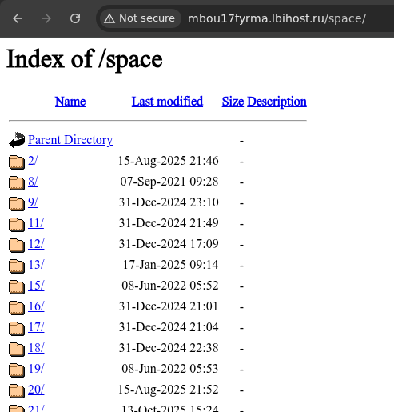
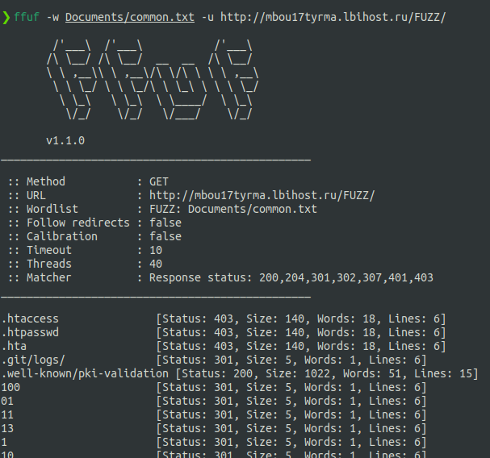
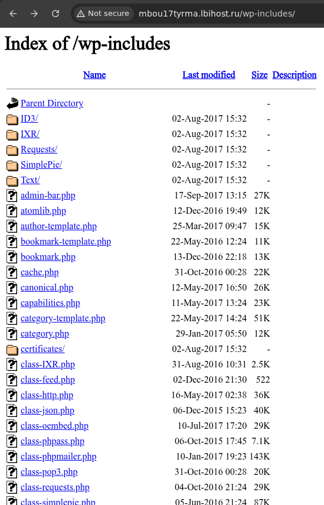
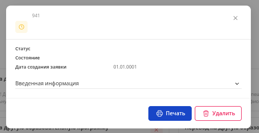

# Лабораторная работа №1*

Работу выполнили:

* Жуков Ростислав Сергеевич
* Сафьянчиков Арсений Сергеевич

---

## Поставленные задачи

Попробовать взломать nginx любого доступного сайта. Проверить минимум три уязвимости - например path traversal, перебор страниц через ffuf и/или любые другие на ваш выбор.

Рекомендую выбрать не супер популярные сайты как google или яндекс, а что-то небольшое локальное, как сайт местной спортивной федерации по бальным танцам или набора инструкций к онлайн игре.

Взлом считается успешным, если вы попали туда, куда не планировалось попадать пользователю, даже если там ничего нет. Успешность взлома не влияет на оценку лабы. 
В отчет приложить скрины попыток взлома, описание уязвимостей, на которые проверяли и итог - успешен взлом или нет.

Важно! без ддоса и подбора паролей :) 
Если найдете реальную уязвимость на сайте, напишите Тане в лс, помогу вам попробовать монетизировать этот вопрос

Обратите внимание, что использование уязвимости в своих целях является незаконным действием. Поэтому если вы смогли попасть куда не следовало, не используйте это а свяжитесь с преподавателем.
Ваша цель в лабораторной - увидеть как неточности в конфигурации могут дать пользователям доступ к тем разделам сайта, которые вы не хотели им давать.


## Ход выполнения работы

Для выполнения лабораторной работы был выбран сайт [
Муниципального бюджетного общеобразовательного учреждения средней общеобразовательной школы № 17 им. В.Н.Новикова Тырминского сельского поселения Верхнебуреинского муниципального района Хабаровского края](http://mbou17tyrma.lbihost.ru/).

Вот как выглядит посёлок, где находится эта школа:


### 1. Path traversal

Первая уязвимость  это возможность обратиться к системным файлам по прямой ссылке. 

Мы открыли одно из изображений с сайта в отдельной вкладке, стёрли пару директрий из URL и получили доступ ко всем системным файлам.



Через эту страничку можно получить доступ к любому файлу сайта. Это показывает важность настройки nginx.

Для предотвращения данной уязвимости в nginx необходимо отключить автоматическую индексацию директорий. Это делается путем изменения директивы autoindex в конфиге. Также можно ограничить доступ другими способами.

```nginx
location / {
    autoindex off;
}
```
### 2. Перебор страниц и директорий через ffuf

Для начала установим утилиту ffuf:

```bash
sudo apt update
sudo apt install ffuf
```

Потом мы скачали очень популярный список для перебора `common.txt` из репозитория `SecLists` и прошлись по сайту.

```bash
ffuf -w Documents/common.txt -u http://mbou17tyrma.lbihost.ru/FUZZ/
```



Программа вывела очень много строк, большинство из которых просто куда то перенаправляют. Выделим самые интересные:

```
icons [Status: 403, Size: 296, Words: 21, Lines: 11]
```

Данная строчка показывает, что существуют всё таки страницы с ограниченным доступом, и мы можем посмотреть их список.

```
phpmyadmin [Status: 200, Size: 7356, Words: 916, Lines: 125]
cgi-bin [Status: 200, Size: 721, Words: 40, Lines: 14]
```

Данные строчки несмотря на свой статус 200 ведут либо на пустые странички, либо на странички, требующие авторизации.

```
wp-includes [Status: 200, Size: 41000, Words: 2357, Lines: 199]
```

А вот тут уже всё серьёзно. Мы получили доступ к какой то важной директории.



Нужно следить за доступом к различным популярным директориям. `ffuf` - хороший инструмент проверить уязвимость сайта.

### 3. IDOR (Небезопасные прямые ссылки на объекты)

Данную уязвимость мы протестируем на [my.itmo.ru](https://my.itmo.ru), пожалеем Тырминскую школу.

Суть уязвимости заключается в получении каких то данных по прямой ссылке. Проверять уязвимость будем в разделе заявки, так как там могут храниться личные данные пользователей, которые мы хотим похитить (шутка).

Когда мы смотрим заявку, мы обращаемся по URI `my.itmo.ru/requests/my/id`

При вводе id заявки, которая не принадлежит авторизованному пользователю, не появляется никакая ошибка, но доступ к данным тоже не даётся.



Это показывает защищёность сайта от данной уязвимости.

## Выводы

В ходе выполнения лабораторной работы мы успешно проанализировали возможные уязвимости сайта.

Лабораторная работа наглядно показала, как простые ошибки в конфигурации сервера и логике приложения могут привести к серьезным уязвимостям.