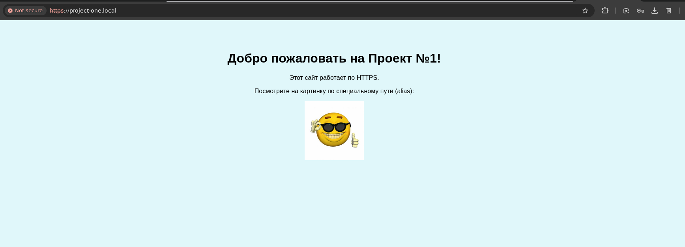
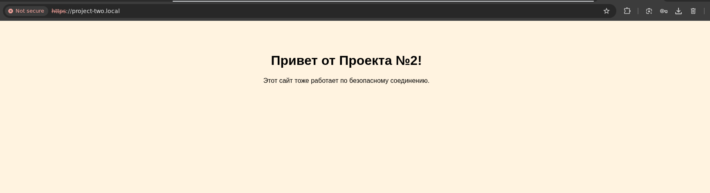

# Лабораторная работа №1

Работу выполнили:

* Жуков Ростислав Сергеевич
* Сафьянчиков Арсений Сергеевич

---

## Поставленные задачи

Настроить nginx по заданному тз:

Должен работать по https c сертификатом
Настроить принудительное перенаправление HTTP-запросов (порт 80) на HTTPS (порт 443) для обеспечения безопасного соединения.
Использовать alias для создания псевдонимов путей к файлам или каталогам на сервере.
Настроить виртуальные хосты для обслуживания нескольких доменных имен на одном сервере.
Что угодно еще под требования проекта.

Результат: Предположим, что у вас есть два пет проекта на одном сервере, которые должны быть доступны по https. Настроенный вами веб сервер умеет работать по https, относить нужный запрос к нужному проекту, переопределять пути исходя из требований пет проектов.


## Ход выполнения работы

Работа выполнялась на Ubuntu.

### Шаг 1: Подготовка

1.  **Установка nginx:**
    ```bash
    sudo apt update
    sudo apt install nginx
    ```

2.  **Создание каталогов для проектов:**
    Были созданы директории для двух сайтов и общая папка для изображений (alias).
    ```bash
    sudo mkdir /var/www/project-one
    sudo mkdir /var/www/project-two
    sudo mkdir /var/www/shared-images
    ```
    Для удобства работы права на эти папки были переданы текущему пользователю.
    ```bash
    sudo chown -R $USER:$USER /var/www/project-one /var/www/project-two /var/www/shared-images
    ```

### Шаг 2: Создание HTML-страниц

Для каждого проекта была создана простая `index.html` страница. Для демонстрации работы `alias` в общую папку было загружено изображение.

*   `/var/www/project-one/index.html` - страница первого проекта.
    ```html
    <!DOCTYPE html>
    <html lang="ru">
    <head>
        <meta charset="UTF-8">
        <title>Проект Один</title>
        <style>
        body { 
            font-family: sans-serif;
            background-color: #e0f7fa; 
            text-align: center; 
            padding-top: 50px; 
            }
        </style>
    </head>
    <body>
        <h1>Добро пожаловать на Проект №1!</h1>
        <p>Этот сайт работает по HTTPS.</p>
        <p>Посмотрите на картинку по специальному пути (alias):</p>
        
    </body>
    </html>
    ```
*   `/var/www/project-two/index.html` - страница второго проекта.
    ```html
    <!DOCTYPE html>
    <html lang="ru">
    <head>
        <meta charset="UTF-8">
        <title>Проект Два</title>
        <style>
        body { 
            font-family: sans-serif;
            background-color: #fff3e0; 
            text-align: center; 
            padding-top: 50px; 
        }
        </style>
    </head>
    <body>
        <h1>Привет от Проекта №2!</h1>
        <p>Этот сайт тоже работает по безопасному соединению.</p>
    </body>
    </html>
    ```
*   `/var/www/shared-images/logo.jpg` - изображение.

### Шаг 3: Настройка HTTPS с самоподписанным сертификатом

Для работы по HTTPS был сгенерирован самоподписанный SSL-сертификат с помощью утилиты `openssl`. Этот метод подходит для локальной разработки, но вызывает предупреждение в браузере.

1.  **Создание папки для сертификатов:**
    ```bash
    sudo mkdir /etc/nginx/ssl
    ```

2.  **Генерация сертификата и ключа:**
    Одной командой были созданы и ключ, и сертификат.
    ```bash
    sudo openssl req -x509 -nodes -days 365 -newkey rsa:2048 \
    -keyout /etc/nginx/ssl/nginx-selfsigned.key \
    -out /etc/nginx/ssl/nginx-selfsigned.crt
    ```

### Шаг 4: Конфигурация nginx

Были созданы два отдельных файла конфигурации для каждого хоста в `/etc/nginx/sites-available/`.

**`project-one.conf`**
```nginx
server {
    listen 80;
    server_name project-one.local;
    return 301 https://$host$request_uri;
}

server {
    listen 443 ssl;
    server_name project-one.local;

    ssl_certificate /etc/nginx/ssl/nginx-selfsigned.crt;
    ssl_certificate_key /etc/nginx/ssl/nginx-selfsigned.key;

    root /var/www/project-one;
    index index.html;

    location /static/ {
        alias /var/www/shared-images/;
    }

    location / {
        try_files $uri $uri/ =404;
    }
}
```

**`project-two.conf`**
```nginx
server {
    listen 80;
    server_name project-two.local;
    return 301 https://$host$request_uri;
}

server {
    listen 443 ssl;
    server_name project-two.local;

    ssl_certificate /etc/nginx/ssl/nginx-selfsigned.crt;
    ssl_certificate_key /etc/nginx/ssl/nginx-selfsigned.key;

    root /var/www/project-two;
    index index.html;

    location / {
        try_files $uri $uri/ =404;
    }
}
```

### Шаг 5: Активация сайтов и настройка DNS

1.  **Редактирование `/etc/hosts`:**
    Для разрешения локальных доменных имен в файл `/etc/hosts` были добавлены следующие записи:
    ```
    127.0.0.1   project-one.local
    127.0.0.1   project-two.local
    ```

2.  **Активация конфигураций:**
    Сайты были "включены" путем создания символических ссылок.
    ```bash
    sudo ln -s /etc/nginx/sites-available/project-one.conf /etc/nginx/sites-enabled/
    sudo ln -s /etc/nginx/sites-available/project-two.conf /etc/nginx/sites-enabled/
    ```

3.  **Проверка и перезапуск Nginx:**
    ```bash
    sudo nginx -t
    sudo systemctl restart nginx
    ```

    На что мы получили положительный ответ:
    ```
    nginx: the configuration file /etc/nginx/nginx.conf syntax is ok
    nginx: configuration file /etc/nginx/nginx.conf test is successful
    ```

## Результаты

В результате выполненных действий:
1.  Два сайта успешно работают на локальной машине и доступны по адресам `https://project-one.local` и `https://project-two.local`.

2.  При попытке зайти по протоколу `http://` происходит автоматическое перенаправление на `https://`.
3.  Браузер показывает предупреждение о небезопасном соединении, потому что сертификат является самоподписанным. Для доступа к сайту необходимо вручную подтвердить исключение безопасности или обратиться к сайту через терминал.
    ```bash
    curl -k --resolve project-one.local:443:127.0.0.1 https://project-one.local
    ```
4.  На сайте `project-one.local` по пути `/static/logo.png` корректно отображается изображение из общей папки `/var/www/shared-images/`, что подтверждает работу alias.




## Вывод

В ходе лабораторной работы были освоен nginx, включая настройку виртуальных хостов, реализацию HTTPS для локальной разработки с помощью самоподписанных сертификатов и использование alias. 